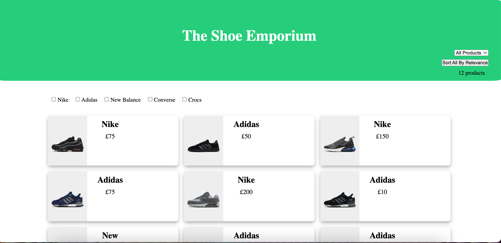

# Hullabalook Technical Assessment



You are provided with a set of products and are required to create a products listing page for a footwear retailer.

Write functionality and styling to:

- Lay out all products in a responsive product grid
- Create a filter toggle that shows only available products
- Create a checkbox brand filter that shows only toggled brand products
- Add a counter for the number of resulting products
- Create a dropdown to sort all products into ascending or descending price order
- Add an option to sort all products by relevance - with all available products shown first in ascending rank order, then all unavailable products in ascending rank order.

You will be assessed on both behaviour and design. Don't spend more than 2 hours on this.

## Instructions

run ```npm install``` then ```npm run dev```. Navigate to the address show in terminal
